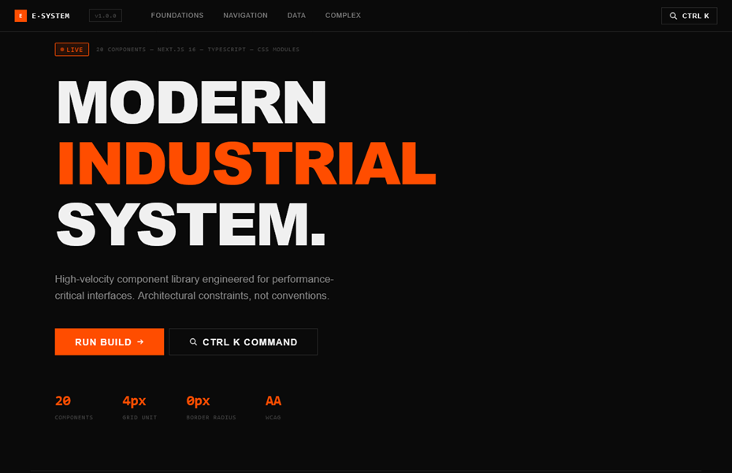

# Component Library

> A fast, considered web experience built with precision. 

### [Live Production Preview](https://modern-industrial-system.madebyever.com/)

### [Live Storybook Link](https://modern-industrial-storybook.madebyever.com/)

---

## Core Focus

Modern Industrial System is a production-grade React component library built around a thesis: a design system should have a strong opinion, not just a colour palette. Every component — from Button to Command Palette — is engineered to look like it came from one place, behave predictably under all input conditions, and remain accessible without exception.

## The Tech Stack

* **Framework:** Next.js (App Router)
* **Styling:** CSS Modules + Tailwind v4
* **Language:** TypeScript

## Key Features

* **5-Token Theme Contract:** Every themeable component references exactly five semantic variables. Switching themes means redefining those five values under a *data-theme* selector. The entire UI repaints in one attribute change.
* **Radix UI (selective):** Used only where the accessibility contract is genuinely complex: Dialog, Accordion, Tooltip.
* **4px Grid + Focus Contract:** Every spacing value is a multiple of 4px, defined as a CSS custom property. Every interactive element ships with a distinct focus-visible state.
